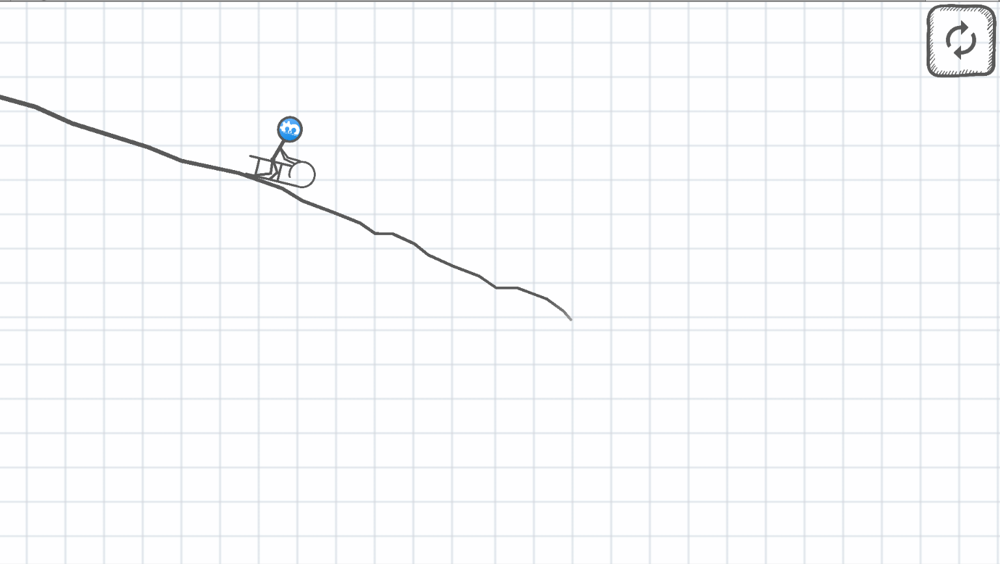

# Line Rider Replica

A "Line Rider" game replica, 2D fun mobile game about just..being creative with lines 🗠.

## Screenshot:

## Game logic:
For now, it's basically to have fun guiding the character on a crazy journey, the crazier the better!

## Tools used:
* Visual studio Code (Text Editor)
* C# (logic)
* Unity (game engine)
* Paint.Net (Image editting)

## Contribution:
Feel free to `fork` this project and add whatever you like. If you have any suggestions or any comments please feel free to contact me or to open an issue, use free license art assets please.

## Team:
[Jetlighters](https://github.com/JetLightStudio) having fun.
